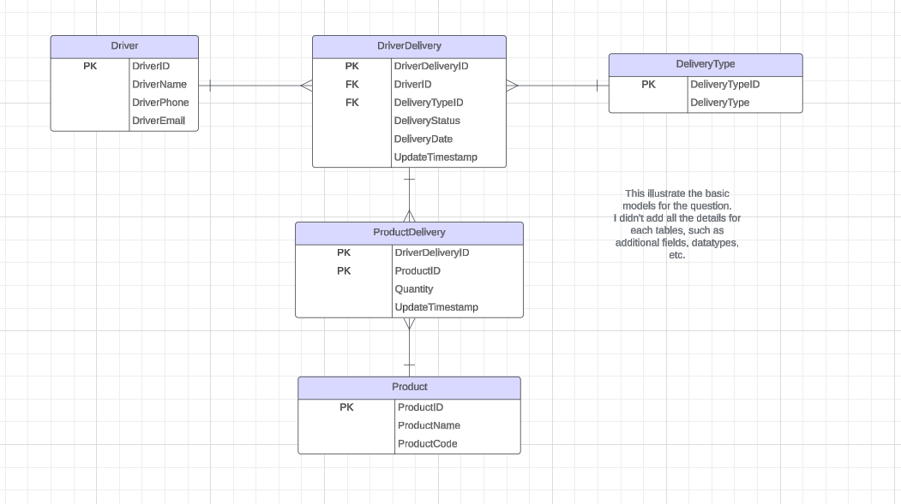
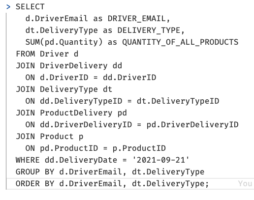

# Clearpoint software dev technical questionnaire and task

The repository for the clearpoint Java questionnaire

## Data Model

## Database Query
The query is looks really long. So in the real world, would be good to split the query into multiple or use nosql database :)

> SELECT
    d.DriverEmail as DRIVER_EMAIL,
    dt.DeliveryType as DELIVERY_TYPE,
    SUM(pd.Quantity) as QUANTITY_OF_ALL_PRODUCTS
  FROM Driver d
  JOIN DriverDelivery dd 
    ON d.DriverID = dd.DriverID
  JOIN DeliveryType dt
    ON dd.DeliveryTypeID = dt.DeliveryTypeID
  JOIN ProductDelivery pd
    ON dd.DriverDeliveryID = pd.DriverDeliveryID
  JOIN Product p
    ON pd.ProductID = p.ProductID
  WHERE dd.DeliveryDate = '2021-09-21'
  GROUP BY d.DriverEmail, dt.DeliveryType
  ORDER BY d.DriverEmail, dt.DeliveryType;

## Clocke application
The application is inside the application folder. It's a maven project. So need Java and maven installed.

* I didn't spend time on all edge test cases. So probably not covered everything.
* I didn't spend time to setup all libs in real development. So just using System.out for logging and not apply any design pattern. 

#### Run the app
mvn compile exec:java -Dexec.mainClass="nz.co.clearpoint.assessment.App" -Dexec.args="1230"

#### Run unit tests
mvn test

## Question 4 Deployment and Cloud

Answer: The Main component A get timeout because the Usage storage component B get blocked by the new component F. They share the same databases, so the DB resouse get high when the batch process happens.

There are a few possible solution can remove that tension form this system.

1. Add a Queue between the compoent F and Database C. So we allow the batch process update DB in small batches.
2. Look in to the database. See if any talbe is not indexed properly and the database schema follows the correct normalization. 
3. Partition the database. Divide the shared database tables in small tables. And isolate the store process between component B and component F.
4. Add caching in Component B. So when main component A call B, it not neccessary to query the database for the result.
5. As Component A only check the 200 HTTP response. I am guess it's try to put data into component B and store in DB? In that case, we could also introduce another queue in Component B. So when A put data via the rest api E, it stores in the Queue and return 200 directly back to A. Then there is a subscriber to listen the queue and update the DB. If it failed will result in a dead letter queue and retry is implemented.
6. We can also increase the resource for the DB. But this probably costly to do :)